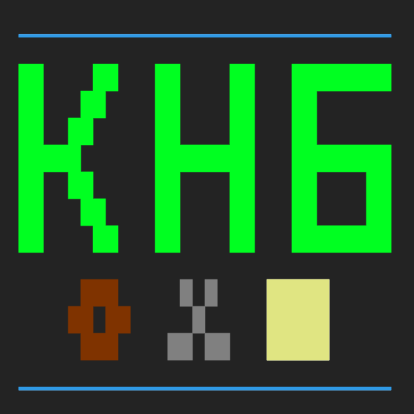

# КАМЕНЬ, НОЖНИЦЫ, БУМАГА
**Браузерная текстовая версия игры «Камень, ножницы, бумага»**

###  0+

## ОСОБЕННОСТИ ИГРЫ
* игра против компьютерного оппонента
* настраиваемая длительность партии
* таблица результатов
* поддержка ввода команд на английском языке
* игра написана на платформе Dialog

## ИНФОРМАЦИЯ ОБ ИГРЕ
* Версия игры: _2_
* IFID: _CD79CF15-55FE-47C0-A23B-0F339708266D_
* Дата компиляции: 260511
* Версия компилятора: Dialog compiler version 1b/01

## ПРАВИЛА
Каждый ход (розыгрыш) вы и ваш компьютерный оппонент, независимо друг от друга, выбираете один из знаков: «_камень_», «_ножницы_» или «_бумагу_».

Исход розыгрыша определяется по следующим правилам:
* камень побеждает (тупит) ножницы
* ножницы побеждают (режут) бумагу
* бумага побеждает (оборачивает) камень

Перед началом игры вам необходимо указать сколько очков нужно будет набрать для победы. Игроки начинают игру с нулём очков. Победившая в розыгрыше сторона получает одно очко. Если стороны выбрали одинаковые знаки — очко не присуждается никому. Побеждает тот, кто первым наберёт установленное количество очков.

Результаты последних 20 сыгранных партий хранятся в «_Таблице результатов_».

## ИГРОВЫЕ КОМАНДЫ
В игре доступны следующие команды:
* _(к)амень_ — показать камень
* _(н)ожницы_ — показать ножницы
* _(б)умага_ — показать бумагу
* _(с)чёт_ — вывести текущий счёт, игровой раунд, а также количество очков, требуемых для победы
* _меню_ — выйти в главное меню (текущая партия не сохранится)
* _сначала_ — начать игровую партию сначала (текущая партия не сохранится)
* _сохранить_ — сохранить состояние игры
* _загрузить_ — восстановить состояние игры
* _таблица_ — вывести результаты сыгранных игр
* _правила_ — вывести правила игры
* _команды_ — вывести список доступных команд
* _инфо_ — вывести информацию об игре
* _выйти_ — завершить выполнение программы (текущая партия не сохранится)

Игра также понимает указанные команды, введённые на английском языке.

## СПИСОК ИЗМЕНЕНИЙ

### ВЕРСИЯ 2

* Увеличена точность распознавания команд за счёт использования новой версии компилятора
* Добавлена возможность выхода в главное меню из диалога установки максимального счёта
* Добавлены дополнительные синонимы и сокращения для команд
* Предупреждение о том, что следующий ход может стать решающим появляется каждый ход, когда счёт одной из сторон отстаёт от максимального на 1 очко
* Стилистические правки

## АВТОРСКИЕ ПРАВА
© Алексей Галкин, 2026

Å-machine Javascript Web Interpreter — copyright 2019-2026 Linus Åkesson and the Dialog Project. [Лицензия](interpreter_license.txt)
